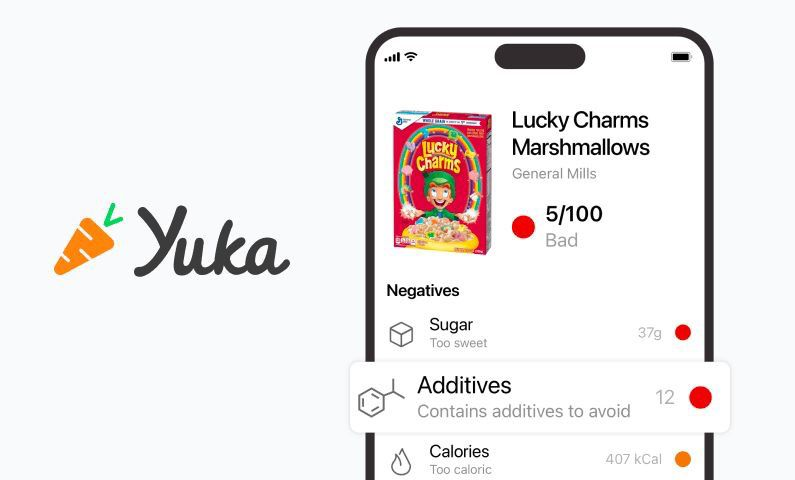
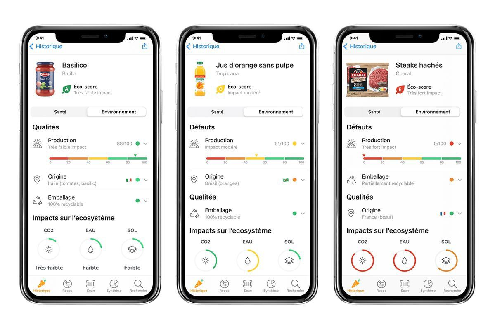
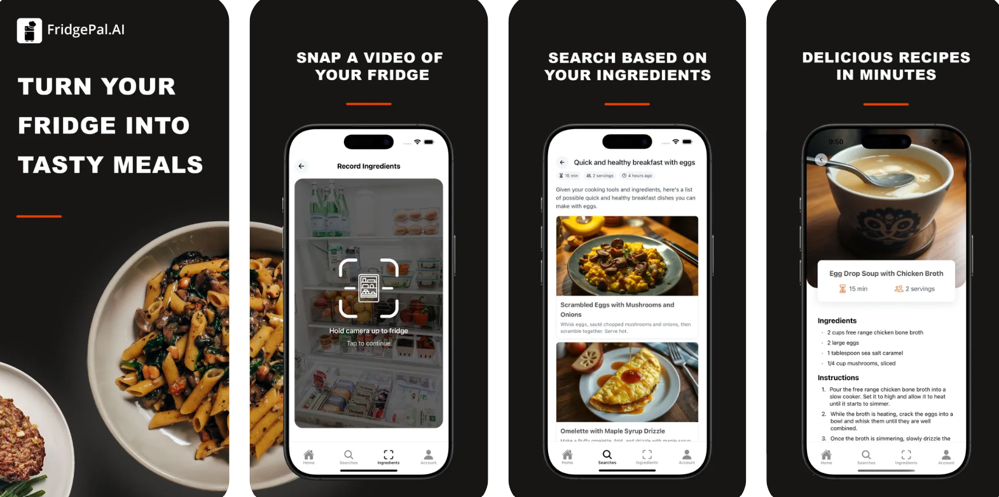

# Soluções Existentes
Antes do desenvolvimento do *EcoMida*, já existiam algumas soluções no mercado voltadas à segurança alimentar, controle de validade e combate ao desperdício de alimentos. A maioria desses aplicativos foca no escaneamento de rótulos, controle de estoque doméstico ou em ações de conscientização para consumo responsável. 
No entanto, grande parte dessas ferramentas apresenta limitações quando se trata de acessibilidade (por exigirem conexão constante com a internet), custo para o usuário ou pouca ênfase no aspecto educacional e social. Além disso, muitas soluções existentes não dialogam diretamente com contextos de vulnerabilidade alimentar ou com regiões que têm acesso restrito à tecnologia. 
O Prato Seguro surge como uma alternativa gratuita, funcional offline e com forte apelo educativo, buscando preencher essas lacunas e contribuir de forma significativa para a segurança alimentar em comunidades diversas.

### Concorrência:
Alguns apps disponíveis no mercado oferecem funcionalidades semelhantes, mas com focos diferentes:
- *Yuka* – Yuka é um aplicativo que analisa a composição de produtos alimentícios e cosméticos, avaliando seu impacto na saúde. Ele funciona através de um scanner que decifra rótulos e fornece uma avaliação do produto em um sistema de cores (excelente, bom, medíocre, ruim), além de oferecer informações detalhadas e sugestões de alternativas mais saudáveis.
  

   

  
- *NoWaste* – O NoWaste é um aplicativo gratuito que permite aos usuários monitorar, organizar e gerenciar os alimentos em casa, com o objetivo de reduzir o desperdício e economizar dinheiro. Disponível para dispositivos iOS, o app oferece ferramentas para criar listas de inventário para a geladeira, freezer e despensa, facilitando o controle dos itens disponíveis e suas datas de validade.
  

  
- *Fridge Pal* – O FridgePal AI é um aplicativo gratuito para iOS que utiliza inteligência artificial para sugerir receitas com base nos ingredientes disponíveis na sua geladeira. Com apenas um vídeo da sua geladeira, o app identifica os itens presentes e propõe receitas personalizadas, considerando preferências alimentares, ferramentas de cozinha e nível de habilidade culinária. 
AppBrain

 

---

### Quadro Comparativo

| Critérios/Soluções       | **NoWaste**                | **Fridge Pal AI**          | **Yuka**                    | **EcoMida**                                              |
|--------------------------|----------------------------|----------------------------|-----------------------------|---------------------------------------------------------------|
| **Modelo de negócio**    | Freemium                   | Gratuito com anúncios      | Freemium                    | Gratuito com foco social                                      |
| **Tecnologia utilizada** | App móvel (iOS/Android)    | App móvel (iOS/Android)    | App móvel com scanner       | App móvel com banco local + backup               |
| **Pontos fortes**        | Notificações, categorização| Facilidade de uso          | Base de dados de produtos   | Offline, acessível, educativo, com guia de uso               |
| **Pontos fracos**        | Precisa de internet        | Interface antiga           | Não ajuda no armazenamento  | Sem escaneamento automático (por enquanto)                   |
| **Público-alvo**         | Pessoas organizadas        | Usuários domésticos        | Consumidores exigentes      | Famílias, comunidades locais, pessoas sem acesso a apps complexos |

