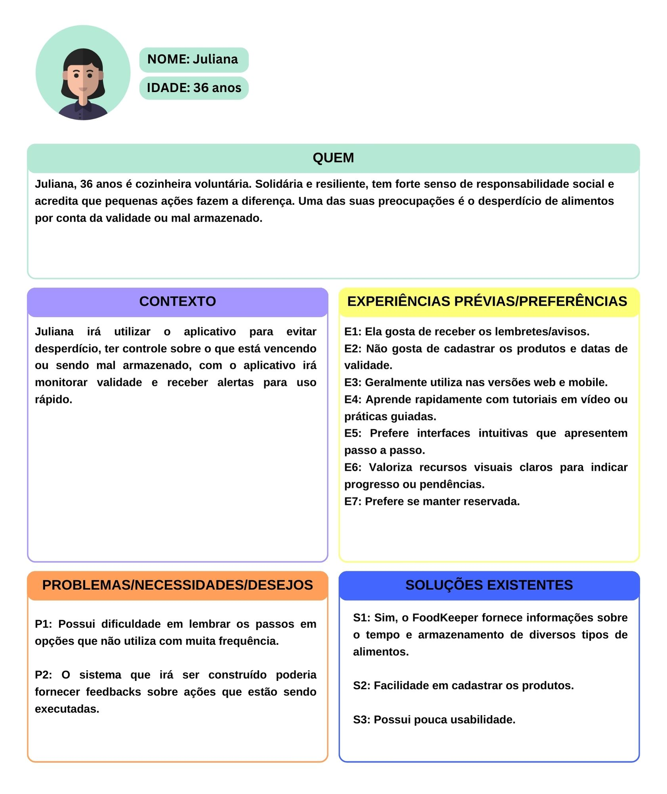
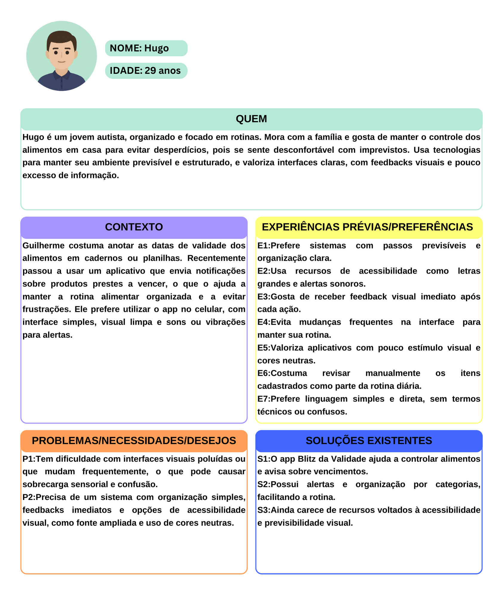

## O que são Personas?
Personas são representações fictícias, baseadas em dados reais, que representam um grupo de usuários ou clientes com características, comportamentos, necessidades e objetivos em comum. Elas são amplamente aplicadas em áreas como design, marketing, desenvolvimento de produtos e experiência do usuário (UX) para guiar decisões estratégicas, usando perfis que refletem os potenciais consumidores ou usuários finais. Criar personas permite às equipes entender melhor os desejos e frustrações de seu público, tornando possível desenvolver produtos e serviços mais alinhados com as expectativas e necessidades genuínas dos usuários.

## Técnica utilizada para a elaboração das Personas: TÉCNICA PATHY 
A Técnica PATHY ajuda a criar personas mais detalhadas e realistas. A técnica utiliza as seguintes perguntas guia para coletar informações relevantes sobre os usuários e suas necessidades:

* Quem (Dados Pessoais);
* Contexto;
* Experiências Prévias/Preferências;
* Problemas/Necessidades/Desejos;
* Soluções Existentes.
  
## Persona 1: Usuário Comum

## Persona 2:  Usuário PcD (Pessoa com deficiência)

## Persona 3: Suporte Técnico

