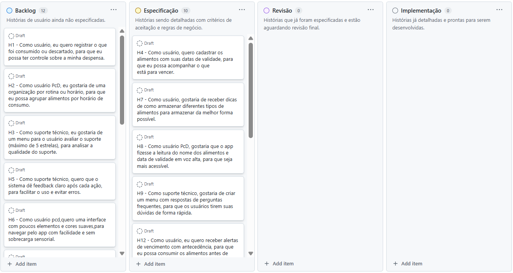

# Backlog do Produto

O ***Backlog do Produto*** representa uma lista priorizada de tudo que é necessário para desenvolver e manter um produto. Ele é gerenciado pelo Product Owner, que é responsável por garantir que os itens estejam claros, organizados e alinhados com os objetivos do projeto. Contém histórias de usuário, funcionalidades, melhorias, correções, requisitos técnicos e quaisquer outras demandas que agreguem valor ao produto final. 

## Como foi feito?

Cada integrante da equipe contribiu no processo de criação e especificação. Foi criado uma tabela no GitHub para o refinamento das histórias, como mostra na imagem abaixo:

## Link para acessar a tabela detalhada:
- [Backlog do Produto](https://github.com/users/xavierrjon/projects/3)
