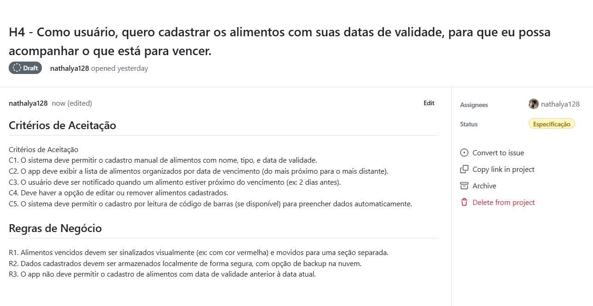
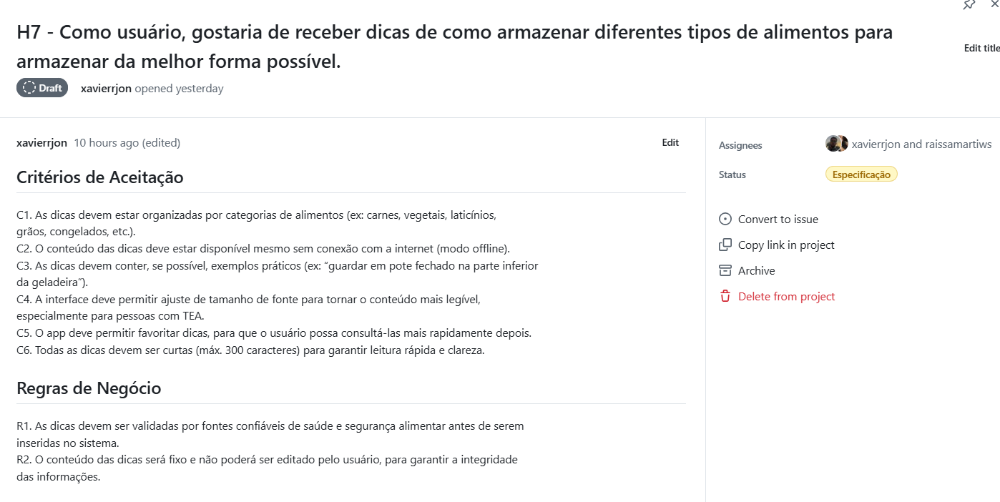
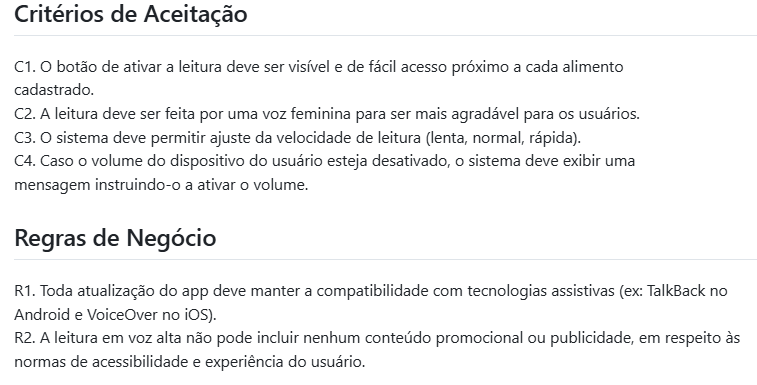
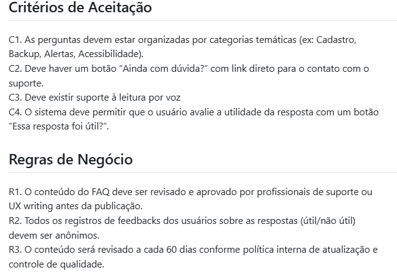

# Backlog do Produto

O ***Backlog do Produto*** representa uma lista priorizada de tudo que é necessário para desenvolver e manter um produto. Ele é gerenciado pelo Product Owner, que é responsável por garantir que os itens estejam claros, organizados e alinhados com os objetivos do projeto. Contém histórias de usuário, funcionalidades, melhorias, correções, requisitos técnicos e quaisquer outras demandas que agreguem valor ao produto final. 

## Como foi feito?

Cada integrante da equipe contribiu no processo de criação e especificação. Foi criado uma tabela no GitHub para o refinamento das histórias, como mostra na imagem abaixo:

# Critérios de Aceitação e Regras de Negócio

***Critérios de Aceitação*** são condições específicas que uma funcionalidade ou requisito de um sistema deve cumprir para ser considerado concluído e aceito pelo cliente, Product Owner ou equipe de qualidade. Eles são utilizados principalmente em metodologias ágeis (como Scrum) para garantir que todos os envolvidos tenham uma compreensão comum do que significa "pronto" para uma entrega.

***Regras de Negócio*** são diretrizes ou restrições específicas que definem o funcionamento interno de uma organização, produto ou sistema. Elas orientam como os processos devem ocorrer, o que é permitido ou proibido, e quais condições devem ser respeitadas para manter a consistência, conformidade e objetivos do negócio.

## Alguns dos nossos Critérios de Aceitação e Regras de Negócio

### H4 - Como usuário, quero cadastrar os alimentos com suas datas de validade, para que eu possa acompanhar o que está para vencer.

### H7 - Como usuário, gostaria de receber dicas de como armazenar diferentes tipos de alimentos para armazenar da melhor forma possível.

### H8 - Como usuário PcD, gostaria que o app fizesse a leitura do nome dos alimentos e data de validade em voz alta, para que seja mais acessível.

### H9 - Como suporte técnico, gostaria de criar um menu com respostas de perguntas frequentes, para que os usuários tirem suas dúvidas de forma rápida.

## Link para acessar a tabela detalhada:
- [Backlog do Produto](https://github.com/users/xavierrjon/projects/3)
