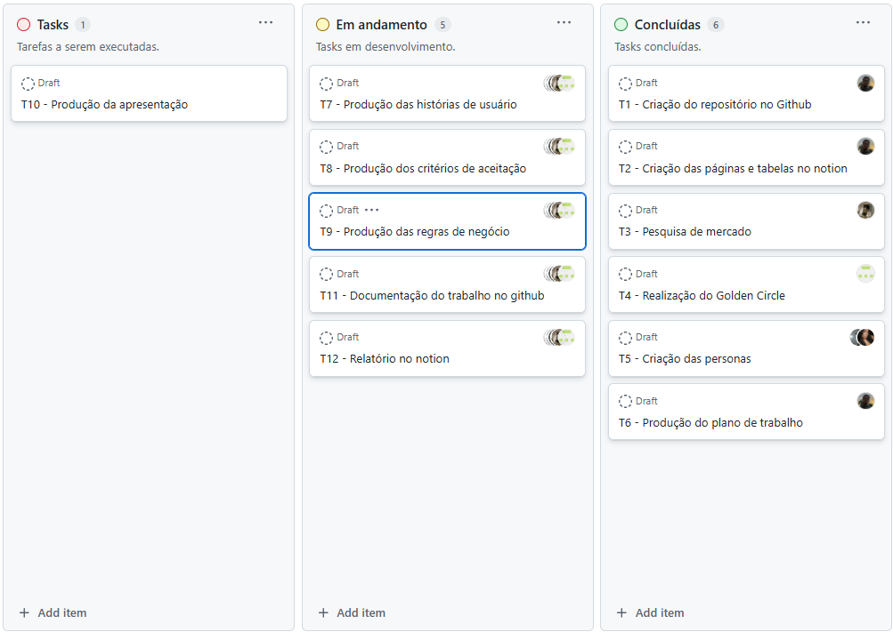

# 1. Backlog do Sprint
O ***Backlog do Sprint*** é composto pelas tarefas que a equipe Scrum se compromete a desenvolver durante um Sprint específico (um ciclo de trabalho com duração fixa, geralmente de 1 a 4 semanas). 
## 1.1 Como foi feito?
No ***Backlog do Sprint*** foram atribuídas tarefas para cada integrante da equipe. As tarefas devem refletir o que foi feito, ajudando a evidenciar o andamento das implementações e o engajamento da equipe, como mostra a imagem abaixo:

## Link para acessar o quadro detalhado: 
## - [Backlog do Sprint]()
