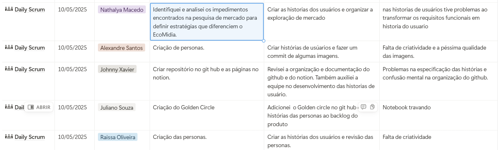

# Daily Scrum
O ***Daily Scrum***, também conhecido como reunião diária, é um evento do Scrum que acontece todos os dias do Sprint, com duração fixa de até 15 minutos. Seu principal objetivo é alinhar o time de desenvolvimento quanto ao progresso das tarefas, identificar impedimentos e planejar o trabalho para as próximas 24 horas.

## Como foi feito?
Durante o ***Daily Scrum***, cada membro da equipe responde, de forma objetiva, a três perguntas:

* O que eu fiz ontem que ajudou o time a atingir o objetivo do Sprint?
* O que vou fazer hoje para contribuir com o objetivo do Sprint?
* Existe algum impedimento que está atrapalhando meu progresso?

Como mostra a imagem abaixo:

## Link para acessar a tabela detalhada no Notion:
## - [Daily Scrum](https://tidy-verdict-694.notion.site/1ee8d94c729481ef9908c0d5ef123786?v=1ee8d94c72948119b0e3000c37a45af3)
